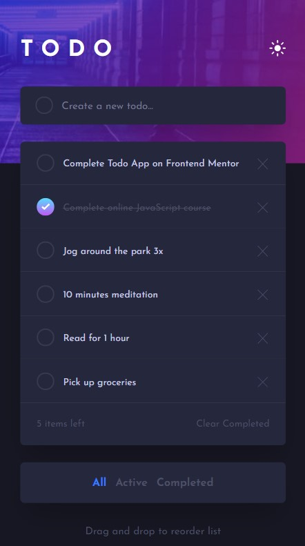

# Frontend Mentor - Todo app solution

This is a solution to the [Todo app challenge on Frontend Mentor](https://www.frontendmentor.io/challenges/todo-app-Su1_KokOW).
### Screenshot

### Demo

[See online my project](http://martazaorska.github.io/todo-app)

### Built with

- [React](https://reactjs.org/)
- [Redux Toolkit](https://redux-toolkit.js.org/)
- [Lodash](https://lodash.com/)
- [Framer Motion](https://www.framer.com/motion/)
- [Styled Components](https://styled-components.com/)
- [uuid](https://www.npmjs.com/package/uuid)

### Author

Created by [Marta Zaorska](https://martazaorska.github.io/portfolio/).
